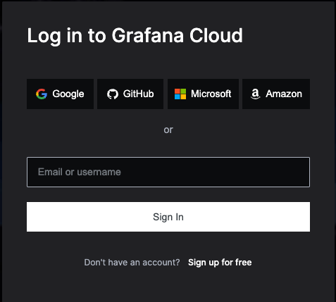

## Breakout 1: Build simple RED dashboard with [TestData DB](https://grafana.com/docs/grafana/latest/datasources/testdata/)

### What Good Looks Like


### Step #1
[Sign in](https://grafana.com/auth/sign-in) to Grafana Cloud. 


### Step #2
| Create a new folder named ```SRE Workshop``` |
|  |

### Step #3
Create new dashboard named ```RED - Test```


### Step #4
Add a new panel named ```Requests Per Second```

### Step #5
TODO

#### Useful Documentation Links
* [Grafana TestData DB](https://grafana.com/docs/grafana/latest/datasources/testdata/)