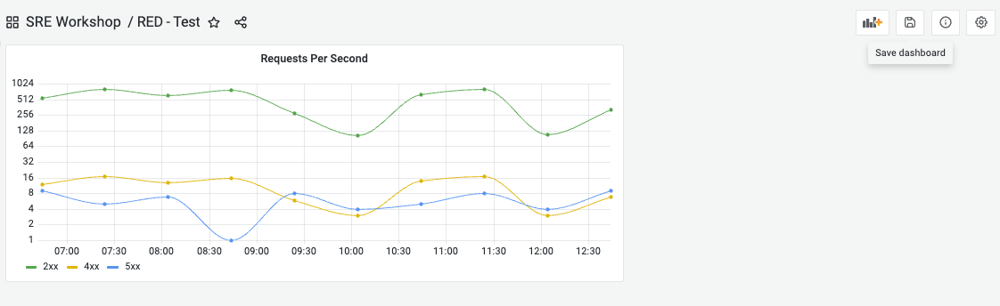

## Breakout 1: Build simple RED dashboard with test data

### What Good Looks Like

### Step #1
[Sign in](https://grafana.com/auth/sign-in) to Grafana Cloud. 

---

### Step #2
Create a new folder named `SRE Workshop` 

---
 

### Step #3
Create new dashboard named `RED - Test`

---

---

---

### Step #4
Add a new panel named `Requests Per Second`

---

1. Change *Panel options -> Title* to `Requests Per Second`
2. Add 3 *TestData DB* datasource queries to the panel
3. Use *Scenario -> CSV Metric Values* 
4. Set A *String Input* = `556,799,615,767,283,105,637,803,107,326` and *Alias* = `2xx`
5. Set B *String Input* = `12,17,13,16,6,3,14,17,3,7` and *Alias* = `4xx`
6. Set C *String Input* = `9,5,7,1,8,4,5,8,4,9` and *Alias* = `5xx`
7. Change *Panel options -> Scale* to `Logarithmic`
8. Change *Panel options -> Line interpolation* to `Smooth`
9. Click *Apply*
10. (Optional) Click *Save* 

---

---

### Step #5
Create a new panel named `Requests by Type`

1. Duplicate `Requests Per Second` panel. Hover mouse cursor on the panel and type `p d`
2. Hover mouse over the duplicate panel and type `e`
3. Change *Panel options -> Title* to `Requests By Type`
4. Click *Transform* tab
5. Add *Series to rows* transform
6. Add *Group by* transform. Set *Metric* to `Group by` and *Value* to `Cacluate` -> `Total`
7. Toggle *Table view* radio button. Note how the data looks.
8. Click *Disable/enable* transformation for both transformations. Note how the data looks with transformations disabled.
9. Click *Disable/enable* transformation for both transformations. We want to use these transformations. 
10. Toggle *Table view* radio button. Click *Open visualization suggestions.
11. Select *Bar gauge LCD* 
12. Click *Apply*
13. (Optional) Click *Save* 

---

---

---

---

### Step #6
Create a new panel named `Error Rate`

1. Duplicate `Requests Per Second` panel. Hover mouse cursor on the panel and type `p d`
2. Hover mouse over the duplicate panel and type `e`
3. Change *Panel options -> Title* to `Error Rate`
4. Change *Visualization* to `Stat`
5. Click *+ Expression* button
6. Set *Operation* to `Reduce` and *Function* to `Sum` and *Input* to `A`
7. Click *Duplicate query* and Set *Operation* to `Reduce` and *Function* to `Sum` and *Input* to `B`
8. Click *Duplicate query* and Set *Operation* to `Reduce` and *Function* to `Sum` and *Input* to `C`
9. Click *+ Expression* button
10. Set *Operation* to `Math` and *Expression* to `($E + $F) / ($D + $E + $F) * 100`
11. Click *Disable/enable query* for `A`, `B`, `C`, `D`, `E`, `F`
12. Set *Color mode* to `Background`
13. Set *Standard options* -> *Unit* to `Percent (0-100)`
14. Add *Thresholds* `3` to `red`, `2` to `yellow`. 
15. Click *Apply*
16. Re-arrange and re-size panels on a single row
17. Click *Save*

---

---

### Step #7
Create a new panel named `Duration`

1. Click *Add panel* button -> *Add a new panel*
2. Change *Panel options -> Title* to `Duration`
3. Add 1 *TestData DB* datasource queries to the panel
4. Select *Scenario -> CSV Metric Values* 
5. Set A *String Input* = `659,414,925,1121,970,962,721,796,787,686` and *Alias* = `latency`
6. Change *Panel options -> Graph styles -> Fill opacity* to `25`

#### Useful Documentation Links
* [Grafana TestData DB](https://grafana.com/docs/grafana/latest/datasources/testdata/)