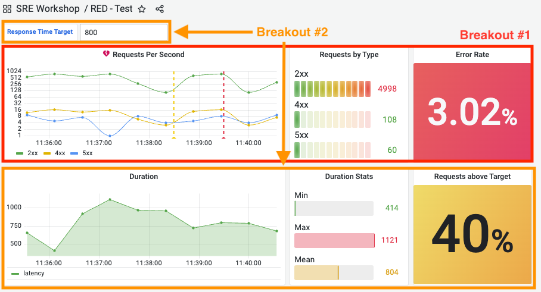
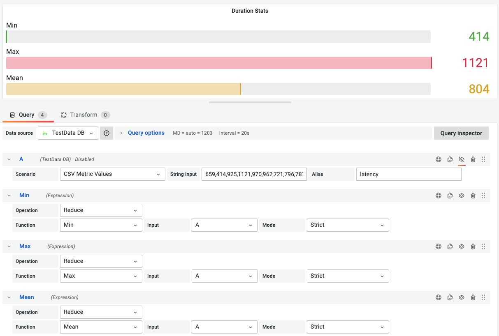

## Breakout 1: RED dashboard with test data - PART 2

### What Good Looks Like

### Step #1
Create a new panel named `Duration`

1. Click *Add panel* button -> *Add a new panel*
2. Change *Panel options -> Title* to `Duration`
3. Add 1 *TestData DB* datasource queries to the panel
4. Select *Scenario -> CSV Metric Values* 
5. Set A *String Input* = `659,414,925,1121,970,962,721,796,787,686` and *Alias* = `latency`
6. Change *Panel options -> Graph styles -> Fill opacity* to `25`
7. 8. Click *Apply*
8. Re-arrange and re-size `Duration` panel below `Requests Per Second` panel
9. Click *Save*

---
 

---
 

### Step #2
Create a new panel named `Duration Stats`

1. Duplicate `Duration` panel. Hover mouse cursor on the panel and type `p d`
2. Hover mouse over the duplicate panel and type `e`
3. Change *Panel options -> Title* to `Duration Stats`
4. Change Visualization to `Bar Gauge`
5. Change *Panel options -> Orientation* to `Horizontal`
6. Change *Panel options -> Display mode* to `Basic`
7. Change *Panel options -> Color scheme* to `Green-Yellow-Red (by value)`
8. Click *+ Expression* button and set *Operation* to `Reduce` and set *Function* to `Min` and set *Input* to `A`
9. Rename Expression *B* to `Min`
10. Click *Duplicate entry* button on the *Min* expression
11. Change *Function* to `Max`
12. Rename Expression *B* to `Max`
13. Click *Duplicate entry* button on the *Max* expression
14. Change *Function* to `Mean`
15. Rename Expression *B* to `Mean`
16. Click *Disable/enable query* button on query *A* 
17. Click *Apply*
18. Re-arrange and re-size `Duration Stats` panel below `Requests By Type` panel
19. Click *Save*

---
 

---
 

### Step #3
Create a new panel named `Duration Stats`

1. Duplicate `Duration` panel. Hover mouse cursor on the panel and type `p d`
2. Hover mouse over the duplicate panel and type `e`
3. Change *Panel options -> Title* to `Requests above Target`
4. Change Visualization to `Stat`
5. Change *Panel options -> Value Options -> Calculation* to `Total`
6. Change *Panel options -> Standard options -> Unit* to `Percent (0-100)`
7. Change *Panel options -> Stat styles -> Color mode* to `Background`
8. Change *Panel options -> Graph mode* to `None`
9. Change *Panel options -> Thresholds -> RED* to `60`
10. Click *+ Add threshold button* -> YELLOW to `30`
11. Click *+ Expression* button and set *Operation* to `Reduce` and set *Function* to `Count` and set *Input* to `A`
12. Click *+ Expression* button and set *Operation* to `Math` and set *Expression* to `($A > 700) / $B * 100`
13. Click *Disable/enable query* button on query *A* 
14. Click *Disable/enable query* button on query *B* 
15. Click *Apply*
18. Re-arrange and re-size `Requests above Target` panel below `Error Rate` panel
19. Click *Save*

---
 

---
  

### Step #4
Create a new dashboard variable named `Response Time Target`

1. Click *Dashboard settings* icon
2. Click *Settings -> Variables* and *Add variable* button
3. Set *General -> Name* to `response_time_target` and *General -> Type* to `Text box` and *General -> Label* to `Response Time Target`
4. Set *Text options -> Default value* to `800`
5. Click *Apply*
6. Click *Save dashboard*

---
 

---
  

---
 

---
  

### Step #5
Edit `Requests above Target` panel so that it uses the new `Response Time Target` variable

1. Hover mouse over the `Requests above Target` panel and type `e`
2. Change query *C* from `($A > 700) / $B * 100` to `($A > $response_time_target) / $B * 100`
3. Click *Apply*
4. Click *Save dashboard*
5. Change *Response Time Target* value from `800` to `1000`
6. Notice that *Requests above Target* went from yellow to red

---
 

---
 

### Step #6 
Add an alert for *Requests Per Second*

1. Hover mouse over the `Requests Per Second` panel and type `e`
2. Click *Alert -> Create alert rule from this panel* button
3. Edit *D Expression* with two conditions. `WHEN last() of B IS ABOVE 10 OR last() of C IS ABOVE 6`
4. Change *Alert evaluation behavior -> Evaluate every* to `30s for 1m`
5. Change *Add details for your alert -> Rule name* to `Error Rate` 
6. Change *Add details for your alert -> Group* to `red`
7. Add two custom labels in *Notifications -> Custom Labels* `app=myapp` and `environment=production`
8. Click *Save and exit* button
9. Wait one minute, and you should see the new alert change from *Normal* -> *Pending* -> *Firing*

---
 

---
 

---
 

---
 

---
 

---
 

---
 

#### Useful References 
* [Grafana University - Going Deeper with Grafana Panels](https://university.grafana.com/learn/public/learning_plan/view/32/playlist-going-deeper-with-grafana-panels)
* [Grafana University - Configuring notifications with Grafana Alerting](https://university.grafana.com/learn/public/learning_plan/view/42/playlist-configuring-notifications-with-grafana-alerting)