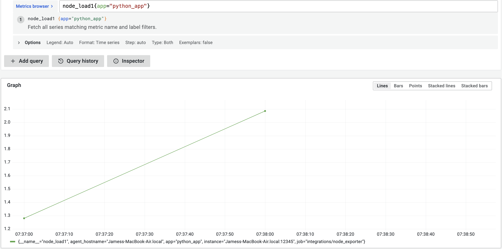
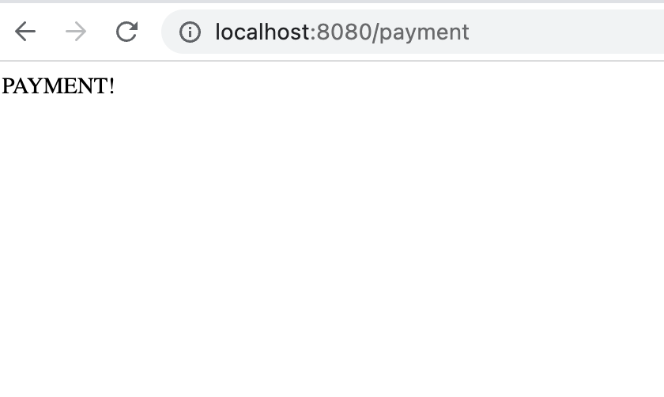
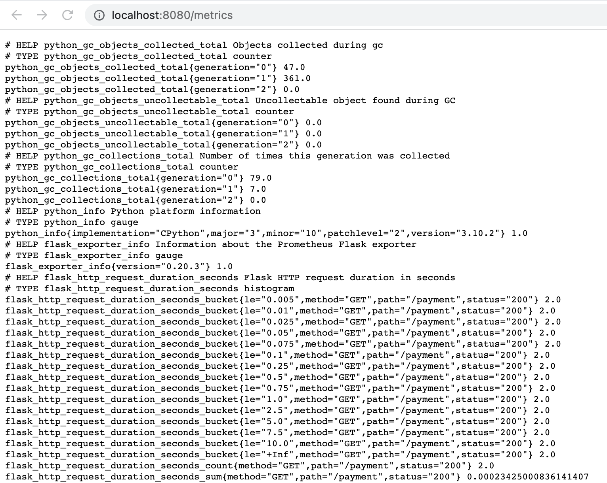
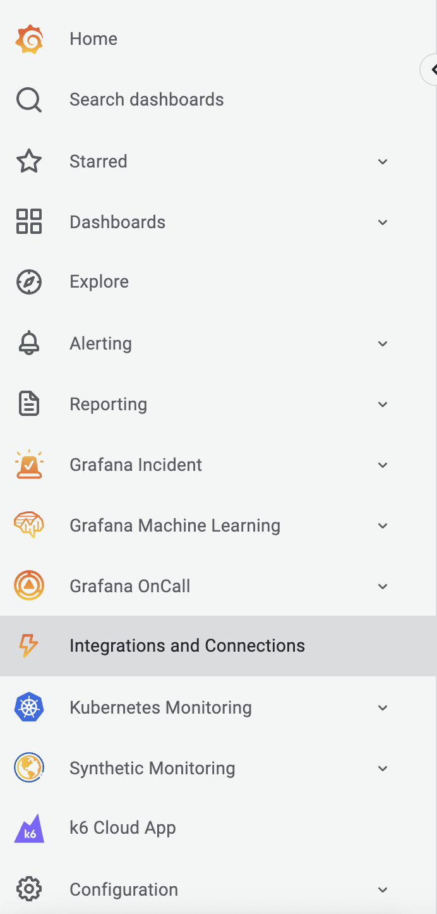
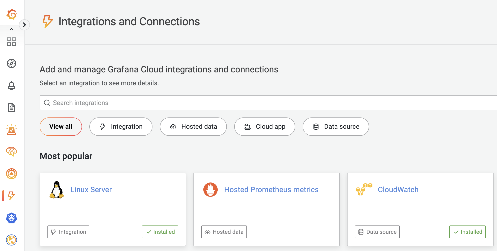
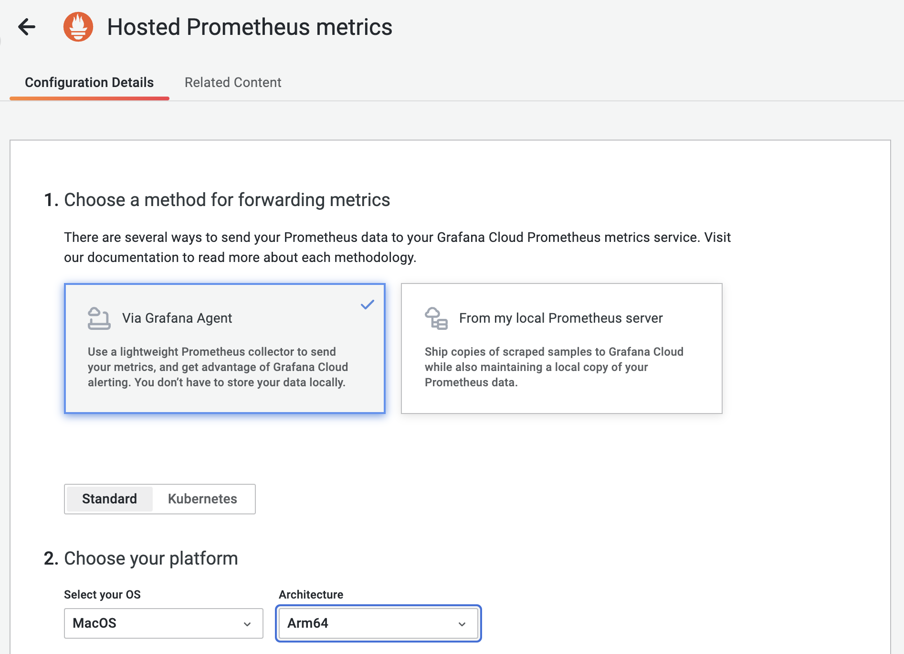
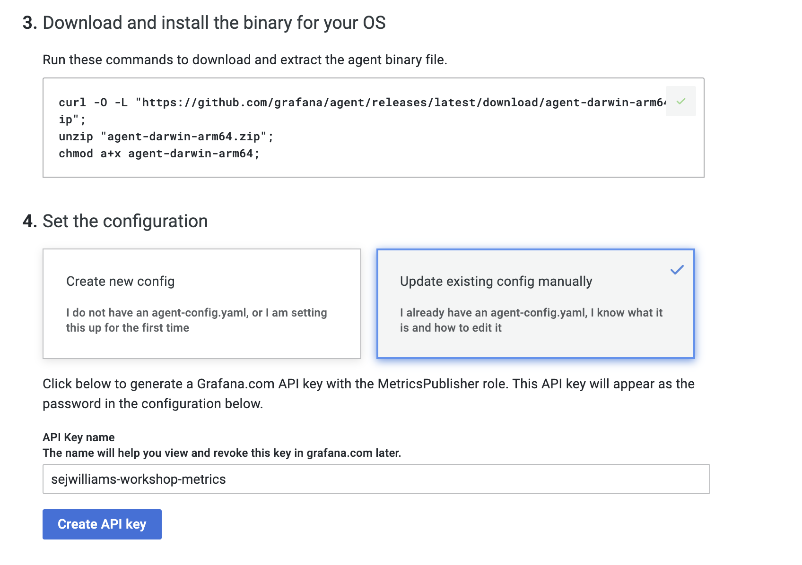
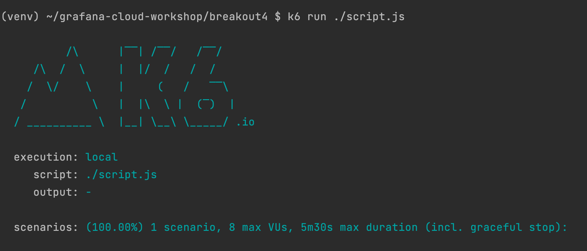

## Breakout 4: Prometheus Metrics

### What Good Looks Like

 

### Step #1
Start local instance of python API. This step requires a working python v3
local installation.

1. Open a terminal window
2. Create a workspace folder `mkdir metrics-workspace`
3. Download python API by running `curl -O https://raw.githubusercontent.com/cfossguy/grafana-cloud-workshop/main/breakout4/app.py`
4. Install python API dependencies via this command `pip install Flask prometheus_flask_exporter logfmter`  
5. Start the API by running `python app.py`
6. Open a browser window to test the endpoint [http://localhost:8080]/payment](http://localhost:8080]/payment)
7. Open a browser window to test the prometheus metrics endpoint [http://localhost:8080]/metrics](http://localhost:8080]/metrics)

---
 

---
 

### Step #2

Setup Hosted Prometheus Metrics Collector

1. Open your grafana cloud browser tab 
2. Navigate to *Integrations and Connections*
3. Click *Hosted Prometheus metrics*
4. Choose a method for forwarding metrics: *Via Grafana Agent*
5. Choose your platform: *Select your OS* and *Architecture*
6. Copy: *Download and install the binary for your OS* commands
7. Open a terminal window in your *metrics-workspace* folder 
8. Paste: *Download and install the binary for your OS* commands
9. Open your grafana cloud browser tab 
10. Set the configuration: *Update existing config manually*
11. Type in *API Key name* `{yourusername}-workshop-metrics`
12. Click *Create API key* button
13. Copy your API key configuration
14. Open a terminal window in your *metrics-workspace* folder 
15. Download grafana agent config template `curl -O https://raw.githubusercontent.com/cfossguy/grafana-cloud-workshop/main/breakout4/agent-config.yaml`
16. Open `agent-config.yaml` in your favorite yaml editor
17. Paste your API key configuration information in `[REMOTE_WRITE_CONFIG_COPY_PASTE]`
18. Save `agent-config.yaml`
19. Open your grafana cloud browser tab
20. Copy *Run the agent* command
21. Open a terminal window in your *metrics-workspace* folder
22. Paste and execute *Run the agent* command

---
 

---
 

---
 

---
 

### Step #3 
Install and set up a k6 OSS load test for the python API.

1. Open a terminal window in your *metrics-workspace* folder 
2. Download k6 client binary directly from [github](https://github.com/grafana/k6/releases) 
- [Mac M1] you can run `curl -O https://github.com/grafana/k6/releases/download/v0.41.0/k6-v0.41.0-macos-arm64.zip`
- [Mac x86] you can run `curl -O https://github.com/grafana/k6/releases/download/v0.41.0/k6-v0.41.0-macos-amd64.zip`
- [Windows] you can install via [windows msi](https://github.com/grafana/k6/releases/download/v0.41.0/k6-v0.41.0-windows-amd64.msi)
- [Linux] you can run `curl -O https://github.com/grafana/k6/releases/download/v0.41.0/k6-v0.41.0-linux-amd64.tar.gz`
3. Extract k6 client 
- [Mac] you can run `unzip k6-v0*.zip`
- [Linux] you can run `tar -xvf k6-v0*.tar.gz`
- [Windows] double click `k6-v0.41.0-windows-amd64.msi`
4. Change to k6 directory 
5. Download load test script by running `curl -O https://raw.githubusercontent.com/cfossguy/grafana-cloud-workshop/main/breakout4/script.js`
6. Run `./k6 run ./script.js`

---
 

#### Useful References 
* [Grafana University - Introduction to metrics](https://university.grafana.com/learn/course/external/view/elearning/13/module-introduction-to-metrics)
* [Grafana Agent - documentation](https://grafana.com/docs/agent/latest/)
* [Node Exporter - github](https://github.com/prometheus/node_exporter)