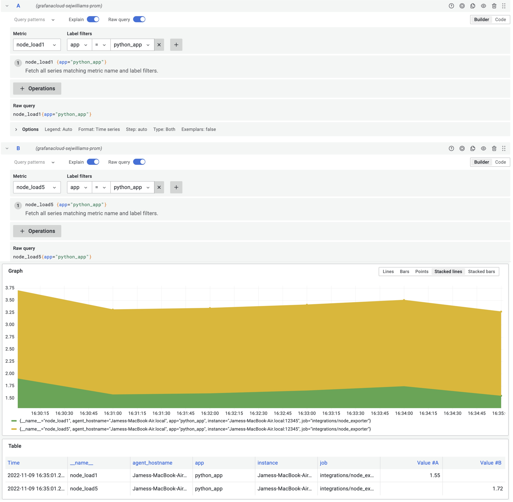
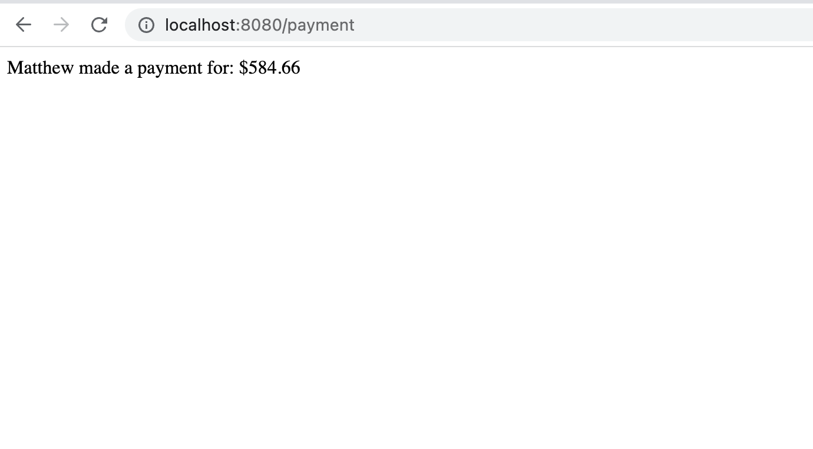

## Breakout 4: Python REST API with node load metrics, response time metrics, recording rules and alert rules - PART 1

### What Good Looks Like
Explore metrics data for a Python API that is running on your workstation. 

 

### Step #1
Start local instance of python API. This step requires a working python v3
local installation.

1. Open a terminal window
2. Create a workspace folder `mkdir metrics-workspace` and `cd metrics-workspace`
3. Download python API by running `curl -O https://raw.githubusercontent.com/cfossguy/grafana-cloud-workshop/main/breakout4/app.py`
4. Install python API dependencies via this command `pip install Flask prometheus_flask_exporter logfmter`  
5. Start the API by running `python app.py`
6. Open a browser window to test the endpoint [http://localhost:8080/payment](http://localhost:8080]/payment)
7. Open a browser window to test the prometheus metrics endpoint [http://localhost:8080/metrics](http://localhost:8080]/metrics)

---
 

---
 

### Step #2

Setup Hosted Prometheus Metrics Collector

1. Open your grafana cloud browser tab 
2. Navigate to *Integrations and Connections*
3. Click *Hosted Prometheus metrics*
4. Choose a method for forwarding metrics: *Via Grafana Agent*
5. Choose your platform: *Select your OS* and *Architecture*
6. Copy: *Download and install the binary for your OS* commands
7. Open a new terminal tab in your *metrics-workspace* folder 
8. Paste: *Download and install the binary for your OS* commands 
15. Download grafana agent config template `curl -O https://raw.githubusercontent.com/cfossguy/grafana-cloud-workshop/main/breakout4/agent-config.yaml`
10. Open your grafana cloud browser tab 
11. Set the configuration: *Update existing config manually*
12. Type in *API Key name* `{yourusername}-workshop-metrics`
13. Click *Create API key* button
14. Copy your API key configuration
15. Open `agent-config.yaml` in your favorite yaml editor
16. Paste your API key configuration information in `[REMOTE_WRITE_CONFIG_COPY_PASTE]`
17. Save `agent-config.yaml`
18. Open your grafana cloud browser tab
19. Copy *Run the agent* command
20. Open a terminal window in your *metrics-workspace* folder
21. Paste and execute *Run the agent* command

---
 

---
 

---
 

---
 

### Step #3 
Install and set up a k6 OSS load test for the python API.

1. Open a new terminal tab in your *metrics-workspace* folder 
2. Download k6 client binary directly from [github](https://github.com/grafana/k6/releases) 
- [Mac M1] you can run `curl -LO https://github.com/grafana/k6/releases/download/v0.41.0/k6-v0.41.0-macos-arm64.zip`
- [Mac x86] you can run `curl -LO https://github.com/grafana/k6/releases/download/v0.41.0/k6-v0.41.0-macos-amd64.zip`
- [Windows] you can install via [windows msi](https://github.com/grafana/k6/releases/download/v0.41.0/k6-v0.41.0-windows-amd64.msi)
- [Linux] you can run `curl -LO https://github.com/grafana/k6/releases/download/v0.41.0/k6-v0.41.0-linux-amd64.tar.gz`
3. Extract k6 client 
- [Mac] you can run `unzip k6-v0*.zip`
- [Linux] you can run `tar -xvf k6-v0*.tar.gz`
- [Windows] double click `k6-v0.41.0-windows-amd64.msi`
4. Change to k6 directory 
5. Download load test script by running `curl -O https://raw.githubusercontent.com/cfossguy/grafana-cloud-workshop/main/breakout4/script.js`
6. Run `./k6 run ./script.js`

---
 

### Step #4 
Explore python API metrics data in Grafana.

1. Open your grafana cloud browser tab and click *Explore* icon
2. Select your grafana cloud prometheus datasource. It will have a name similar to *grafanacloud-yourusername-prom*
3. In *A* click *Builder* button
4. Set *A* *Metric* to `node_load1` and *Label filters* to `app=python_app`
5. Click *Duplicate query* icon
6. Set *B* *Metric* to `node_load5`
7. Click *Run query* button 
8. Change *Graph* from *Lines* to *Stacked lines*

---
 

---
 

#### Useful References 
* [Grafana University - Introduction to metrics](https://university.grafana.com/learn/course/external/view/elearning/13/module-introduction-to-metrics)
* [Grafana Agent - documentation](https://grafana.com/docs/agent/latest/)
* [Node Exporter - github](https://github.com/prometheus/node_exporter)
* [K6 documentation](https://k6.io/docs/)