## Breakout 5: REST API with metrics, recording rules, and alert rules - PART 2

### What Good Looks Like

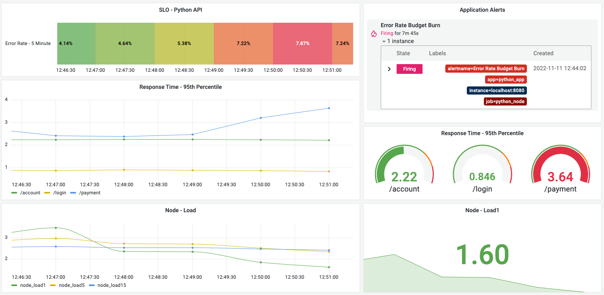 

### Step #1

1. Navigate to *SRE Workshop* folder
2. Create new dashboard named `REST - API`

---
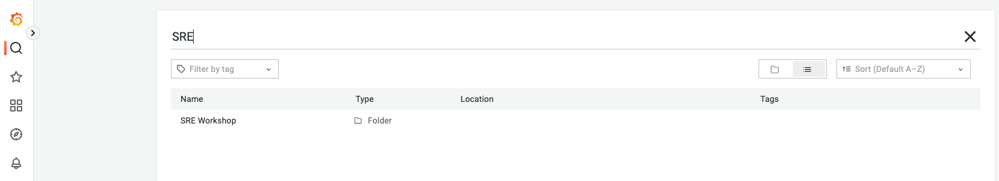

---
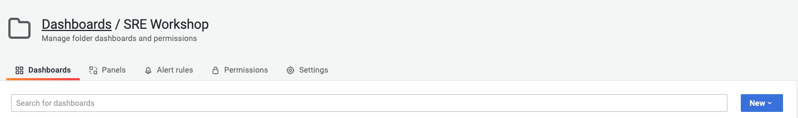

### Step #2

Add a new panel named `Node - Load`

1. Change *Panel options -> Title* to `Node - Load`
2. Select *Data source* `grafanacloud-yourstackname-prom`
3. Paste this PromQL query in *Metrics browser* field `node_load1{app="python_app"}` 
4. Set *Options -> Legend* to `{{__name__}}`
5. Click *Duplicate entry* icon
6. Paste this PromQL query in *Metrics browser* field `node_load5{app="python_app"}`
7. Click *Duplicate entry* icon
8. Paste this PromQL query in *Metrics browser* field `node_load15{app="python_app"}`
9. Click *Apply*
10. (Optional) Click *Save* 

---
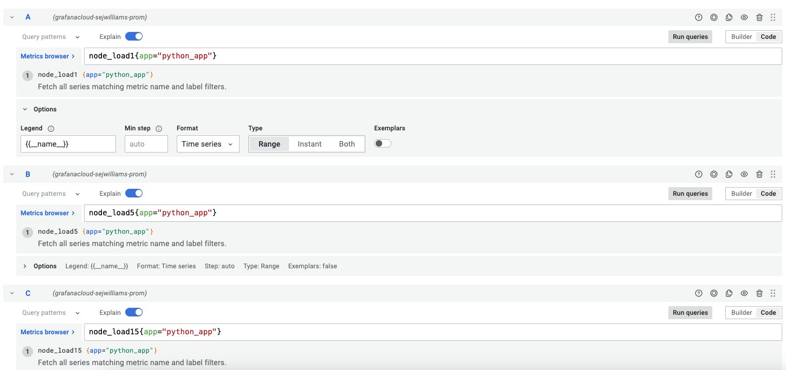

### Step #3 

Add a new panel named `Node - Load1`

1. Duplicate `Node - Load` panel. Hover mouse cursor on the panel and type `p d`
2. Hover mouse over the duplicate panel and type `e`
3. Change *Panel options -> Title* to `Node - Load1`
4. Change visualization to `Stat`
5. Click *Remove query* button for queries *B* and *C*
12. Click *Apply*
13. (Optional) Click *Save* 

---
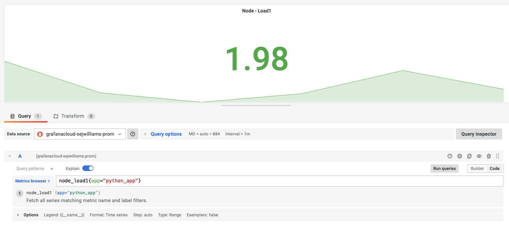

### Step #4 

Add a new panel named `Response Time - 95th Percentile`

1. Duplicate `Node - Load` panel. Hover mouse cursor on the panel and type `p d`
2. Hover mouse over the duplicate panel and type `e`
3. Change visualization to `Gauge`
4. Click *Apply*
5. (Optional) Click *Save* 

---
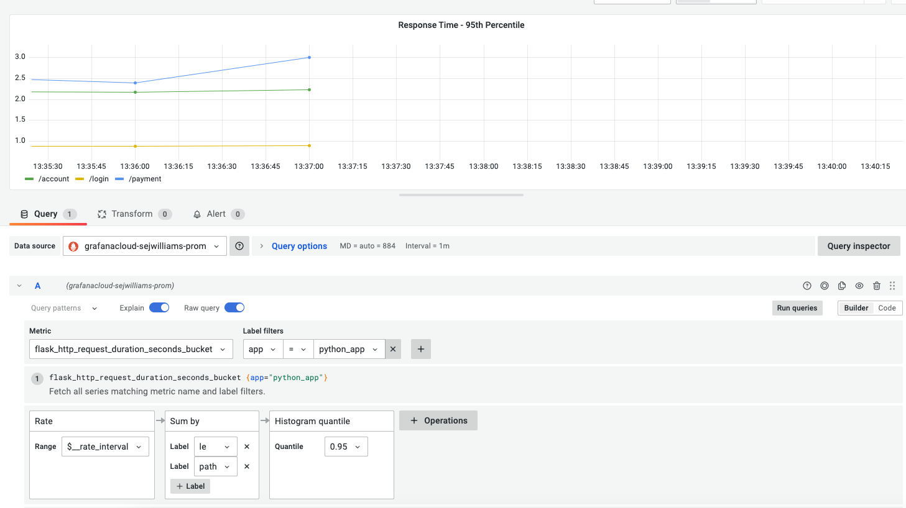

### Step #5

Add a new panel named `Response Time - 95th Percentile`

1. Duplicate `Response Time - 95th Percentile` panel. Hover mouse cursor on the panel and type `p d`
2. Hover mouse over the duplicate panel and type `e`
3. Change *Panel options -> Title* to `Response Time - 95th Percentile`
4. Toggle query *A* from *Code -> Builder* the *Builder* button
5. Select *Metric* dropdown `flask_http_request_duration_seconds_bucket` 
6. Select *Label filters* `app = python_app`
7. Click *hint: add histogram_quantile()* button
8. IN *Sum by* box add *Label* `path`
9. Click *Apply*
10. (Optional) Click *Save* 

---
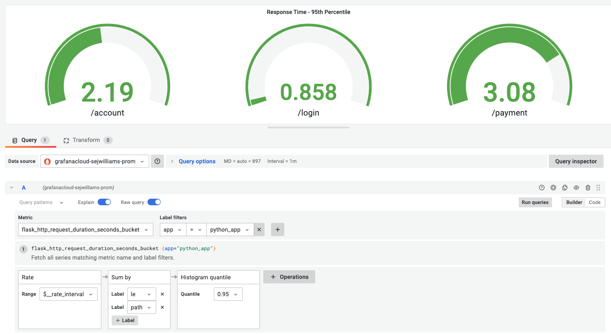

### Step #6

Create a recording rule for HTTP error rate over a 5 minute SLO window

1. Click *Alerting* icon and stay on *Alert rules* tab
2. Click *new alert rule* button
3. Select *Mimir or Loki recording rule* radio button 
4. Select *Data source* `grafanacloud-yourstackname-prom`
5. Paste this query in the *Metrics browser* `(sum(rate(flask_http_request_total{method="GET",status="500"}[5m])) without(method, status) / sum(rate(flask_http_request_total[5m])) without(method, status))`
6. In *Rule name* field, paste `slo:error_rate5m`
7. In *Namespace* dropdown, click *+Add new* -> `SRE Workshop`
8. In *Group* dropdown, click *+Add new* -> `python-app.rules`
9. In *Custom Labels* field add `app` = `python_app`
10. Click *Save and exit* button

---
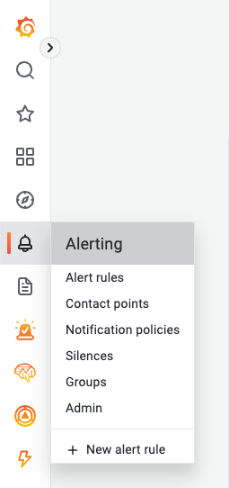

---
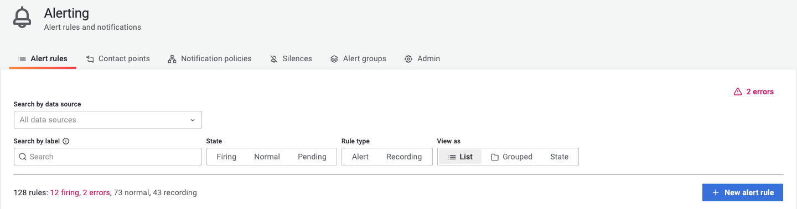

---
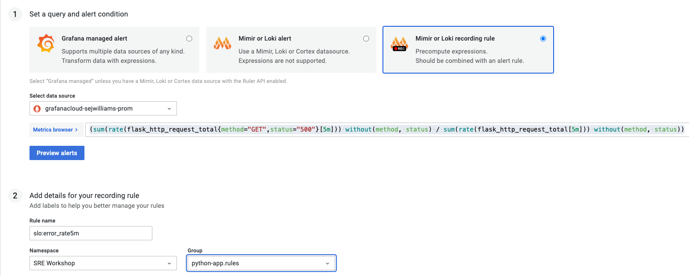

---
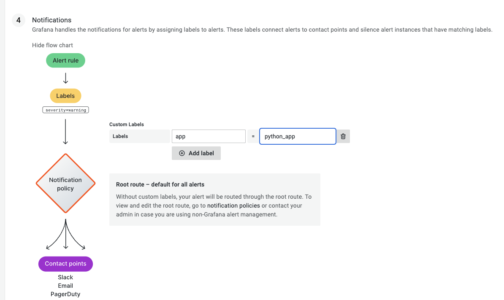

### Step #7

Create Mimir alert for the HTTP error rate recording rule

1. Click *new alert rule* button 
2. Select *Mimir or Loki alert* radio button 
3. Select *Data source* `grafanacloud-yourstackname-prom`
4. Paste this query in the *Metrics browser* `slo:error_rate5m > .05`
5. Click `Preview alerts` button. If no alerts are displayed, try changing query to `slo:error_rate5m > .01`
6. In *Rule name* field, paste `Error Rate Budget Burn`
7. In *Namespace* dropdown, select `SRE Workshop`
8. In *Group* dropdown, select `python-app.rules`
9. In *Description* field, paste `Error rate for {{ $labels.app }} is in violation of 5 minute SLO.`
10. In *Summary* field, paste `Error Rate SLO`
11. In *Custom Labels* field add `app` = `python_app`10. Click *Save and exit* button

---
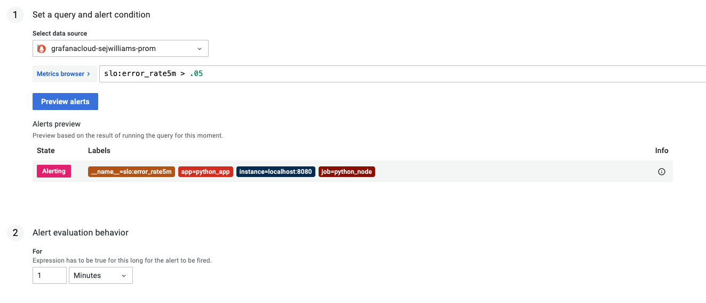

---
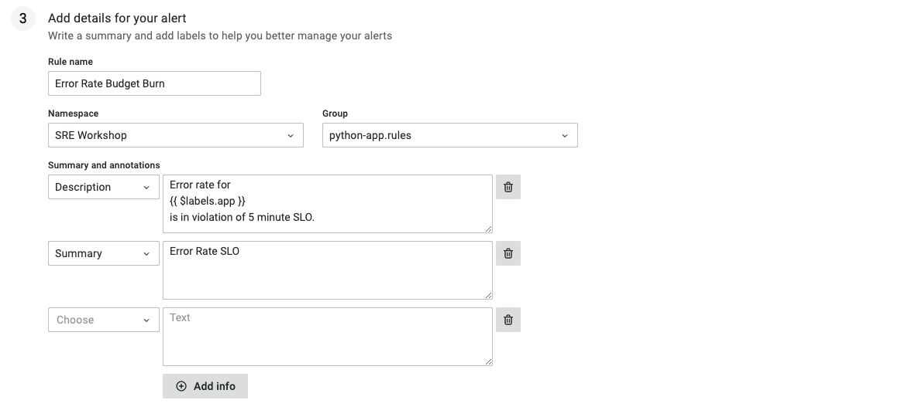

---
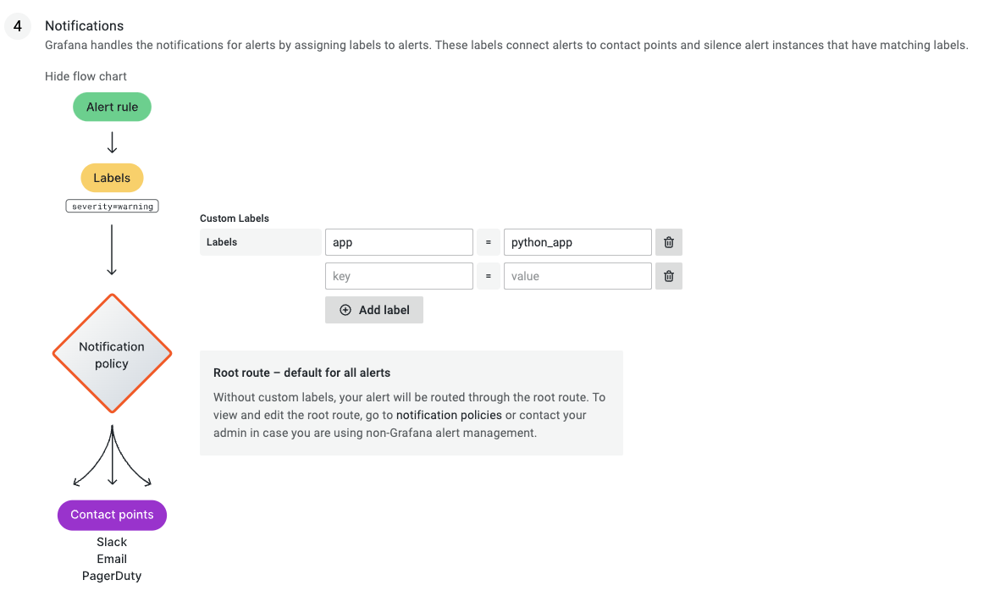

---
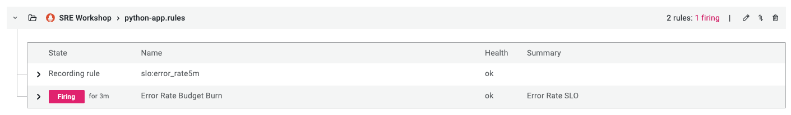

### Step #8

Add a new panel named `Application Alerts`

1. Click *Add panel* icon
2. Click *Add a new panel*
3. Change panel visualiztion to *Alert list*
4. Change *Panel Options -> Title* to `Application Alerts`
5. In *Panel Options -> Filter -> Folder* field select `SRE Workshop` 
6. In *Panel Options -> Filter -> Datasource* field select `grafanacloud-yourstackname-prom`
7. Click *Apply*
8. (Optional) Click *Save* 

---
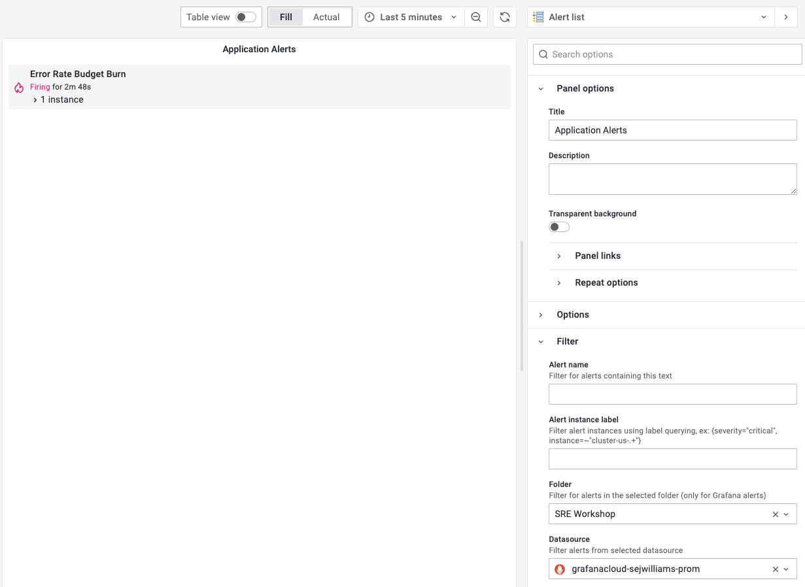

### Step #9

Add a new panel named `SLO - Python API`

1. Click *Add panel* icon
2. Click *Add a new panel*
3. Change panel visualiztion to *State timeline*
4. Change *Panel Options -> Title* to `SLO - Python API`
4. Set *Panel Options -> State timeline -> Align values* to `Center`
5. In *Panel Options -> Standard options -> Unit* field select `Percent (0.0-1.0)` 
6. In *Panel Options -> Standard options -> Display name* field paste `Error Rate - 5 Minute` 
7. In *Panel Options -> Standard options -> Color schemme* select `Green-Yello-Red (by value)` 
8. In *Panel Options -> Legend* uncheck *Visibility* radio button
9. Select *Data source* `grafanacloud-yourstackname-prom`
10. In query *A* paste this query into *Metrics browser* field `slo:error_rate5m`
11. Click *Apply*
12. (Optional) Click *Save* 

---
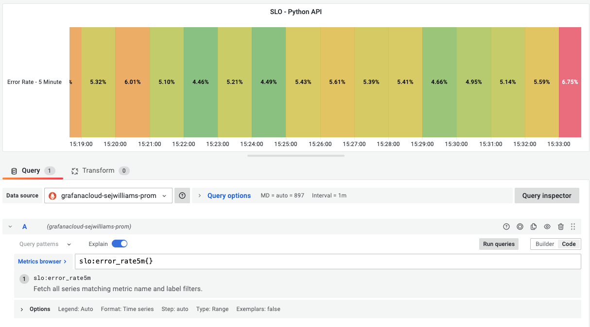

### Step #10

Re-arrange the panels so they look like this reference dashboard

---
 

#### Useful References 
* [Grafana University -  Configuring notifications with Grafana Alerting](https://university.grafana.com/learn/public/learning_plan/view/42/playlist-configuring-notifications-with-grafana-alerting)
* [Introduction to histograms and heatmaps](https://grafana.com/docs/grafana/latest/fundamentals/intro-histograms/)
* [Grafana Alerting](https://grafana.com/docs/grafana/latest/alerting/)

