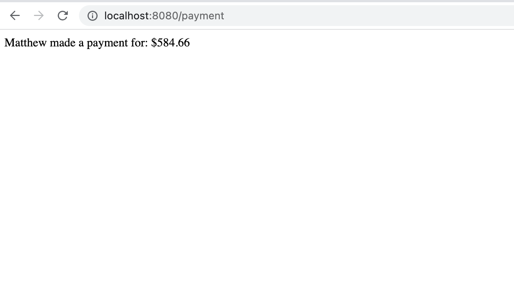
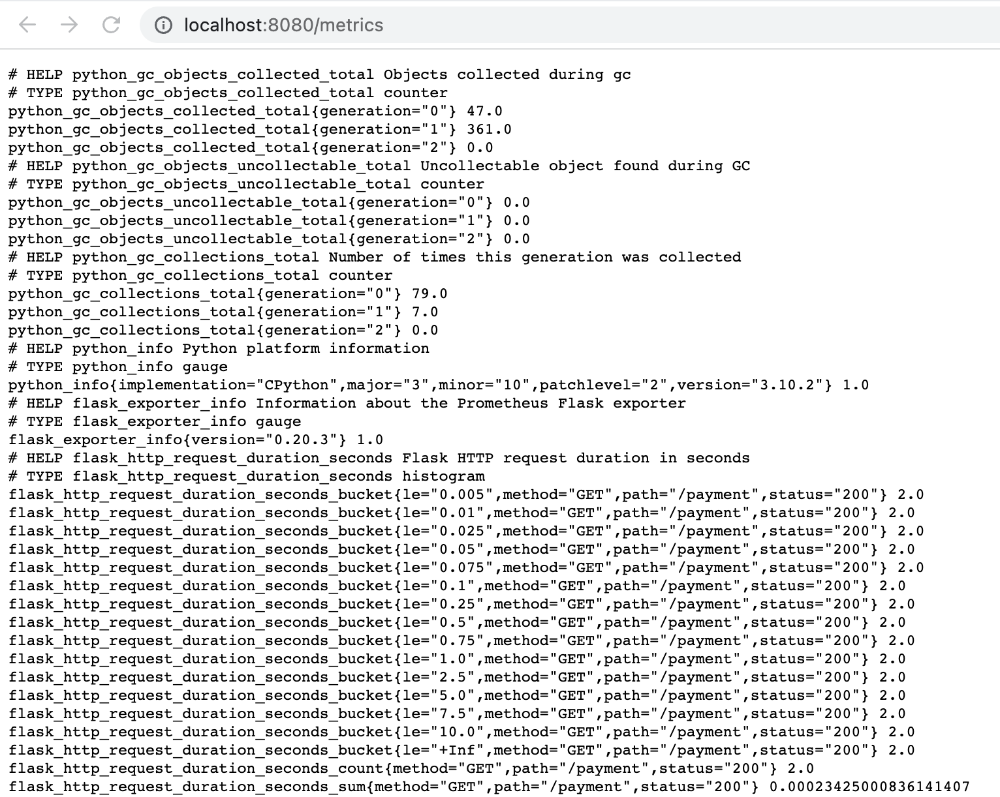
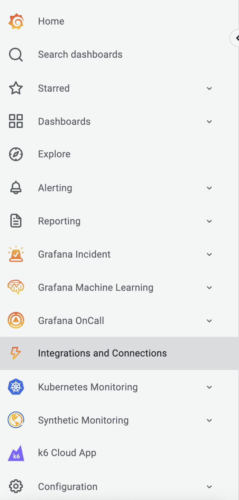
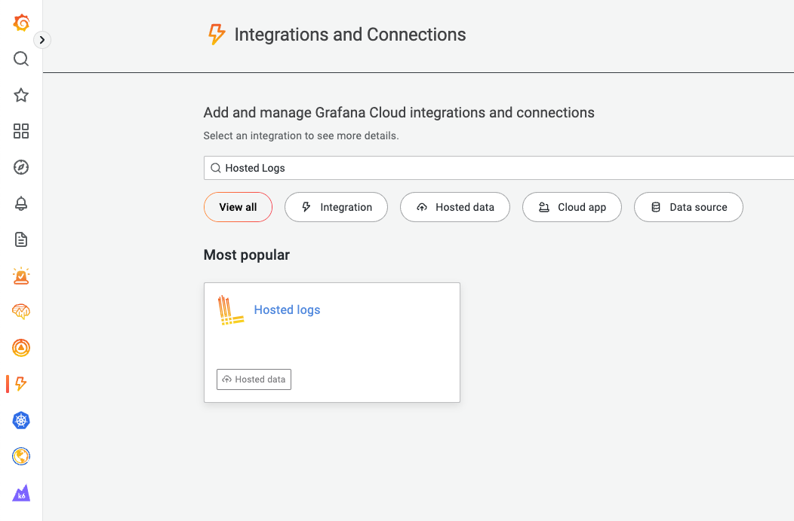
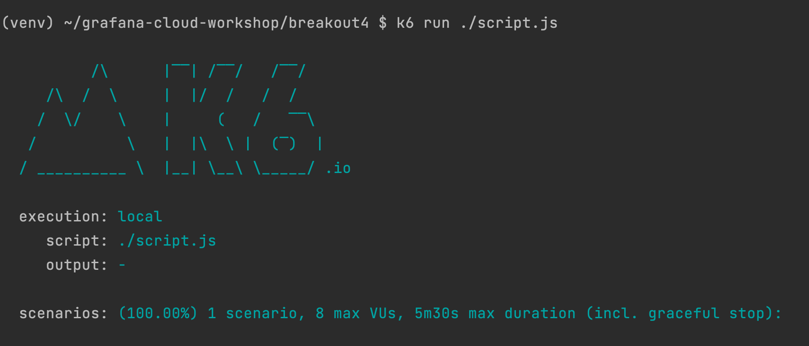

## Breakout 6: REST API with logs, recording rules, and alert rules 

### What Good Looks Like
Explore logs data for a Python API that is running on your workstation. 

### Step #1
Make sure your python API is still running.

1. Open a terminal window
2. Go to your workshop workspace folder `cd grafana-workspace`
5. Start the API by running `python app.py`
6. Open a browser window to test the endpoint [http://localhost:8080/payment](http://localhost:8080]/payment)
7. Open a browser window to test the prometheus metrics endpoint [http://localhost:8080/metrics](http://localhost:8080]/metrics)

---
 

---
 

### Step #2

Setup Hosted Prometheus Logs Collector

1. Open your grafana cloud browser tab 
2. Navigate to *Integrations and Connections*
3. Click *Hosted Logs*
4. Choose your usecase: *Send logs from a standalone host* 
5. Type in *API Key name* `{yourusername}-workshop-logs`
6. Click *Create API key* button
7. Copy your API key configuration
8. Open a new terminal tab in your *grafana-workspace* folder 
9. Download grafana agent logs config template `curl -O https://raw.githubusercontent.com/cfossguy/grafana-cloud-workshop/main/breakout6/logs-agent-config.yaml`
10. Append grafana agent logs config to your current *agent-config.yaml* file `cat >> ./agent-config.yaml ./logs-agent-config.yaml `
11. Open `agent-config.yaml` in your favorite yaml editor
12. Paste your logs *client -> url* value in `[LOGS_WRITE_CONFIG_COPY_PASTE]`
13. Paste the full path to your *grafana-workspace* folder in `[APP_LOG_PATH]`
14. Save `agent-config.yaml`
15. Re-start the grafana agent

---
 

---
 

---

### Step #3 
Make sure your k6 load test is still running.

1. Open a new terminal tab in your *grafana-workspace* folder
2. Change to `k6` directory 
3. Run `./k6 run ./script.js`

---
 

### Step #4 
Explore python API logs data in Grafana.

1. Open your grafana cloud browser tab and click *Explore* icon
2. Select your grafana cloud prometheus datasource. It will have a name similar to *grafanacloud-yourusername-logs*
TODO

#### Useful References - TODO
* [Grafana University - Introduction to metrics](https://university.grafana.com/learn/course/external/view/elearning/13/module-introduction-to-metrics)
* [Grafana Agent - documentation](https://grafana.com/docs/agent/latest/)
* [Node Exporter - github](https://github.com/prometheus/node_exporter)
* [K6 documentation](https://k6.io/docs/)