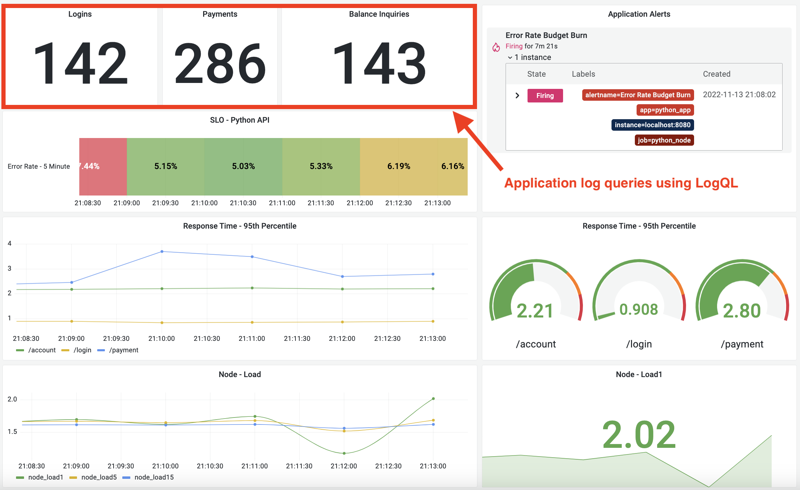
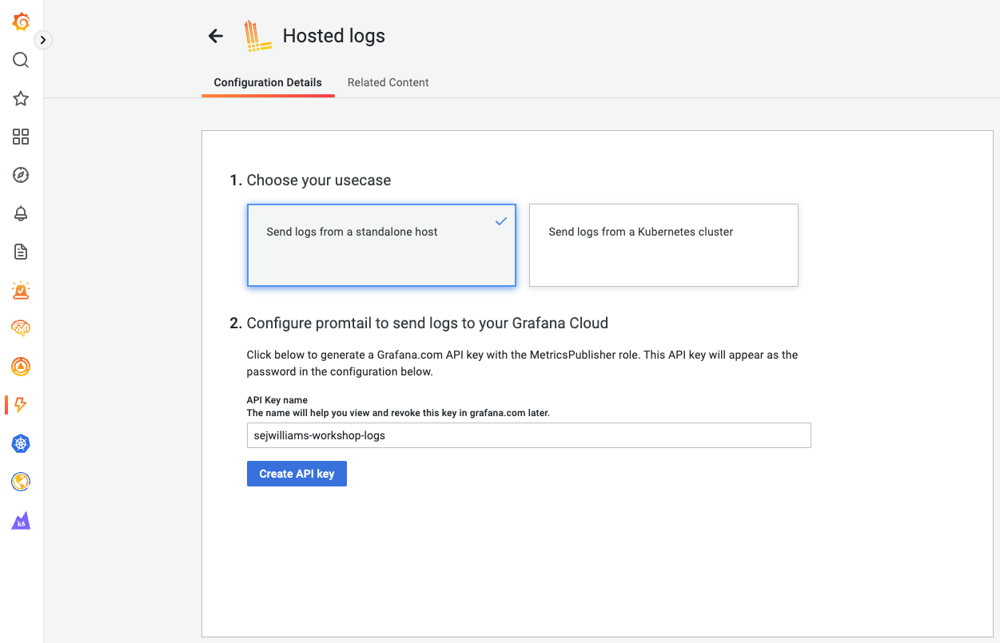
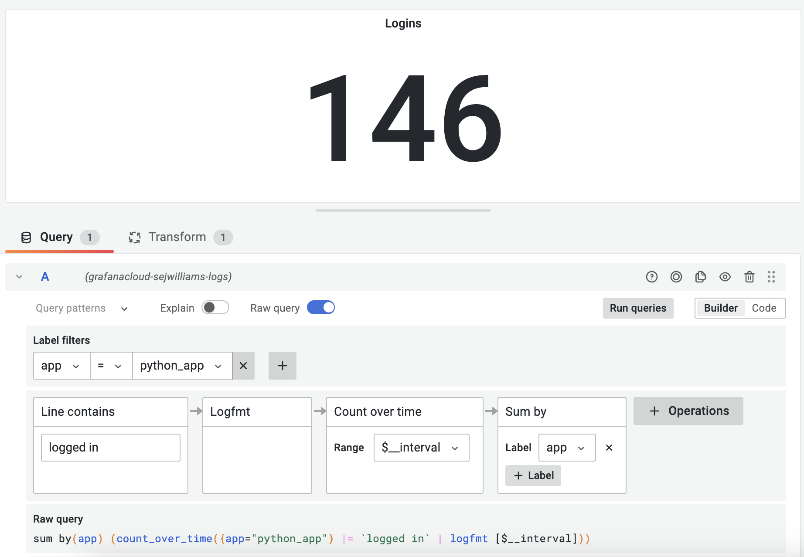
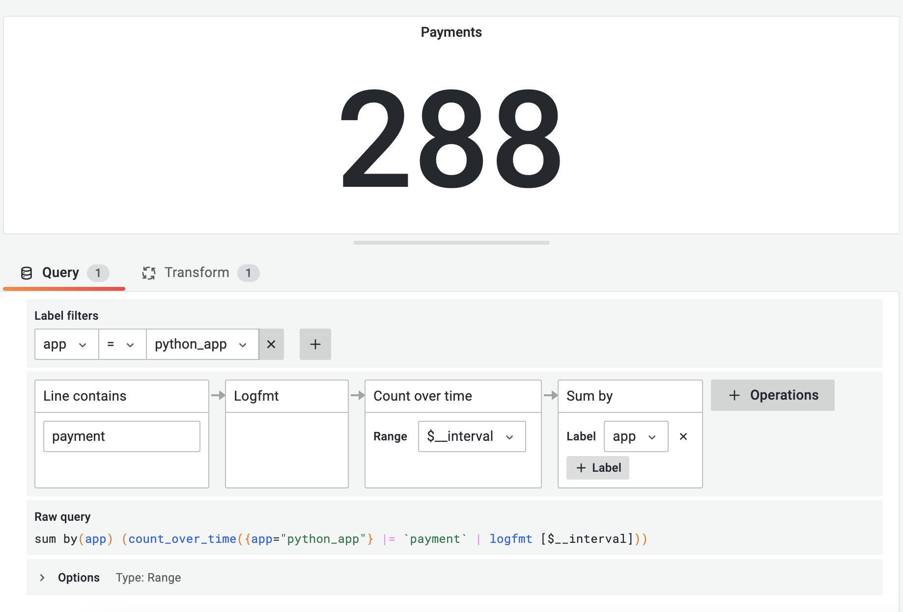

## Breakout 6: REST API with logs, recording rules, and alert rules - PART 1

### What Good Looks Like
Explore logs data for a Python API that is running on your workstation. 

### Step #1
Make sure your python API is still running.

1. Open a terminal window
2. Go to your workshop workspace folder `cd grafana-workspace`
5. Start the API by running `python app.py`
6. Open a browser window to test the endpoint [http://localhost:8080/payment](http://localhost:8080]/payment)
7. Open a browser window to test the prometheus metrics endpoint [http://localhost:8080/metrics](http://localhost:8080]/metrics)

---
 

---
 

### Step #2

Setup Hosted Prometheus Logs Collector

1. Open your grafana cloud browser tab 
2. Navigate to *Integrations and Connections*
3. Click *Hosted Logs*
4. Choose your usecase: *Send logs from a standalone host* 
5. Type in *API Key name* `{yourusername}-workshop-logs`
6. Click *Create API key* button
7. Copy your API key configuration
8. Open a new terminal tab in your *grafana-workspace* folder 
9. Download grafana agent logs config template `curl -O https://raw.githubusercontent.com/cfossguy/grafana-cloud-workshop/main/breakout6/logs-agent-config.yaml`
10. Append grafana agent logs config to your current *agent-config.yaml* file `cat >> ./agent-config.yaml ./logs-agent-config.yaml`
11. Open `agent-config.yaml` in your favorite yaml editor
12. Paste your logs *client -> url* value in `[LOGS_WRITE_CONFIG_COPY_PASTE]`
13. Paste the full path to your *grafana-workspace* folder in `[APP_LOG_PATH]`
14. Save `agent-config.yaml`
15. Re-start the grafana agent

---
 

---
 

---

### Step #3 
Make sure your k6 load test is still running.

1. Open a new terminal tab in your *grafana-workspace* folder
2. Change to `k6` directory 
3. Run `./k6 run ./script.js`

---
 

### Step #4 
Explore python API log data in Grafana.

1. Open your grafana cloud browser tab and click *Explore* icon
2. Select your grafana cloud prometheus datasource. It will have a name similar to *grafanacloud-yourusername-logs*
3. In *A* click on the *Builder* button (if not already selected)
4. In *A* set *Label filters* to `app` = `python_app`
5. In *A* click *hint: add logfmt_parser()* button
6. Click *Run query* button 
7. In *Logs* scroll down to the first *red* color coded log entry 
8. Expand log entry
9. In *Log labels* click *Filter for value* icon 
10. Scroll back up top of screen
11. Notice that a new *Label filter expression* has been added to *A*

---
 

---
 

---
 

---
 

### Step #5 
Add user login count panel to the *REST - API* dashboard.

1. Open a browser window to *REST - API* dashboard
2. Duplicate `Node - Load1` panel. Hover mouse cursor on the panel and type `p d`
3. Hover mouse over the duplicate panel and type `e`
4. Change *Panel options -> Title* to `Logins`
5. Select *Data source* `grafanacloud-yourstackname-logs`
6. In *A* click *Builder* button
7. In *A* set *Label filters* to `app` = `python_app`
8. In *A* click *hint: add logfmt_parser()* button
9. In *A* click *+ Operations -> Line filters -> Line contains*
10. In *Line contains -> Text to find* type `logged in`
11. In *A* click *+ Operations -> Range functions -> Count over time*
12. In *A* click *+ Operations -> Aggregations -> Sum* and set *Label* to `app`
13. Click *Transform* tab and select `Series to rows` transformation
14. Change *Panel options -> Value options -> Calculation* to `Total`
15. Change *Panel options -> Stat styles -> Color mode* to `None`
16. Change *Panel options -> Stat styles -> Graph mode* to `None`
17. Click *Apply*
18. (Optional) Click *Save*

---
 

---

### Step #6 
EXTRA CREDIT: Add user payment and balance count panels to the *REST - API* dashboard.

1. HINT: The raw query for *Payments* panel is: `sum by(app) (count_over_time({app="python_app"} |= "payment" | logfmt [$__interval]))`
2. HINT: The raw query for *Balance Inquiries* panel is: `sum by(app) (count_over_time({app="python_app"} |= "balance" | logfmt [$__interval]))`

---
 

---

#### Useful References - TODO
* [Grafana University - Intro to querying Loki with LogQL](https://university.grafana.com/learn/public/learning_plan/view/19/playlist-intro-to-querying-loki-with-logql)
* [Grafana University - Extracting text from log lines and creating labels using LogQL parsers](https://university.grafana.com/learn/public/learning_plan/view/16/playlist-extracting-text-from-log-lines-and-creating-labels-using-logql-parsers)
* [Grafana University - Introduction to Logs](https://university.grafana.com/learn/course/external/view/elearning/21/module-introduction-to-logs)
* [Grafana Agent - logs config documentation](https://grafana.com/docs/agent/latest/configuration/logs-config/)